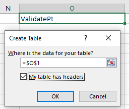
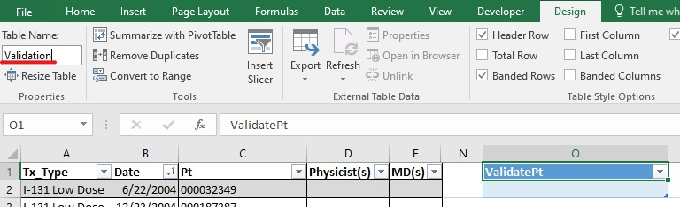
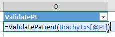
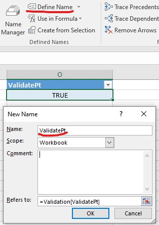
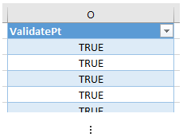
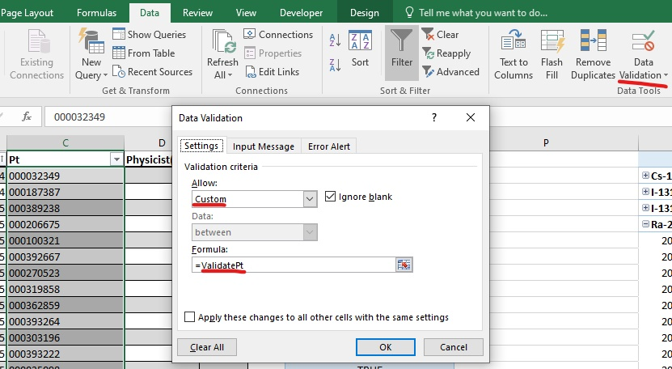
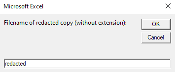
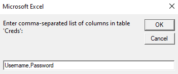

# Med Phys Spreadsheets
Spreadsheets from my work as Radiation Physicist Assistant at Cookeville Regional Medical Center. Also includes a few Excel and Word VBA scripts. Some spreadsheets have sensitive information redacted—thus the filenames ending in _REDACTED_. All files were created in Excel or Word 2016 and are not guaranteed to work in any other version of Excel/Word.

Some spreadsheets include "How to Use" instructions for end users, plus technical/implementation information as appropriate. These technical details are only necessary for anyone modifying the spreadsheet beyond entering data.

This document is technical/implementation information for the VBA scripts.
## CustomValidation
Excel add-in for data validation that cannot be done using Excel's Data Validation alone.

The add-in contains a single module with several functions. Each function's name starts with `Validate` (e.g., `ValidateMRN`). Most functions takes a single argument: the range (must be a single cell) whose value to validate. Each function returns `True` if the value is valid, `False` otherwise.

These functions are meant to be used in named ranges which can be used in Custom Data Validation.
### Example
Here is an example of implementing custom data validation using this add-in, named ranges, and Excel's built-in Data Validation.

In my [Brachy Txs](./Brachy Txs.xlsm) spreadsheet, each `Pt` value must be either an MRN or a patient name. The `CustomValidation` `ValidatePatient` performs this validation. To implement the validation, I:
1. Create a `Validation` table with a column `ValidatePt`. 
 

2. In the first row of the `ValidatePt` column, call the `ValidatePatient` function, passing in the `Pt` cell as an argument. 

3. Create a named range from the cell in the previous step. 

4. Fill in the remaining rows of the `Validation` table. 

5. Add Data Validation to the `Pt` column. Use the range name as the custom formula. 

## FmtTbls
Macro that applies a standard format to all tables in the current Word document. Specifically, it does the following:
- Sets default borders.
- Horizontally and vertically center aligns table values.
- Sets uniform row height.
- Center aligns the table.
- AutoFits column widths.
- Disallows the table from spanning multiple pages.
- Bolds the first row (header row).
- Changes red text to black highlighted text.
- Sets the font.

## RedactedSpreadsheet
Excel add-in for redacting sensitive values from tables in a spreadsheet. A copy of the current workbook is created, with the following cell values replaced with `[redacted]`:
- Email addresses
- Non-blank cell values in the user-specified columns
The add-in contains a single macro, `RedactedSpreadsheet`.
### Example
I used the `RedactedSpreadsheet` add-in to redact sensitive information in my `Credentials & Computer Info` spreadsheet. Here are my steps:
1. I want a redacted copy called `redacted`. 

2. For each table in each sheet, I specify the columns I want desensitized. In table `Creds`, these are `Username` and `Password`. 
 
If no columns contain sensitive information, you may leave the input blank.

3. A spreadsheet `redacted.xlsx` has been created, opened, and saved in the same directory as the original spreadsheet.